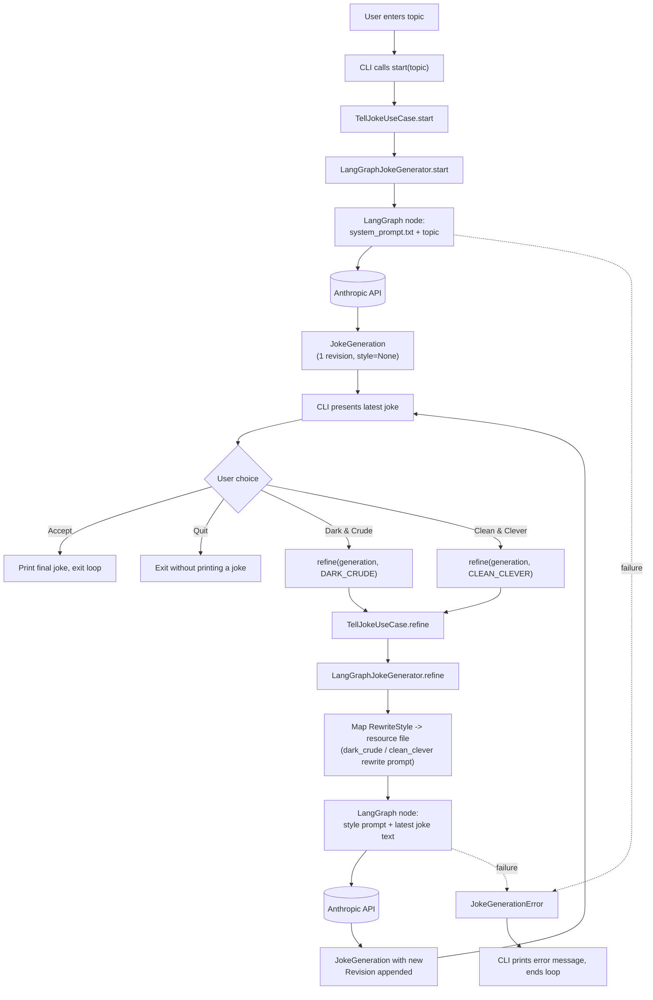

# Design

## Context

Today: one-shot `Joke(topic, text)`, `JokeGenerator.generate(topic) -> str`, single ask-then-print CLI run. See proposal.md for motivation.

## Goals / Non-Goals

**Goals:**
- LangGraph stays inside the outbound adapter only.
- `JokeGeneration` is the single source of truth for session history.

**Non-Goals:**
- No cross-run persistence.
- No config or inbound-adapter changes.
- No cap on refinement rounds.

## Flow

## Decisions

- **`RewriteStyle` enum** (`DARK_CRUDE`, `CLEAN_CLEVER`) replaces free-text feedback: fixed CLI menu, no arbitrary text reaching the model.
- **`Revision(joke, style)`**: `style` is `None` for the first revision, else the style that produced it.
- **Port**: `start(topic) -> JokeGeneration`, `refine(generation, style: RewriteStyle) -> JokeGeneration`, both raising `JokeGenerationError`.
- **Adapter**: one LangGraph node per call; `refine` picks the system prompt by `RewriteStyle` and sends only the latest joke's text, not the full history.
- **State**: port is stateless per call; no LangGraph checkpointer.
- **Error translation**: same SDK-exception → `JokeGenerationError` pattern as today's adapter.

## Risks / Trade-offs

- New `langgraph` dependency → isolated to the outbound adapter.
- Breaking port change → contained to this change's own touched files.
- No cross-run persistence → acceptable per Non-Goals.
